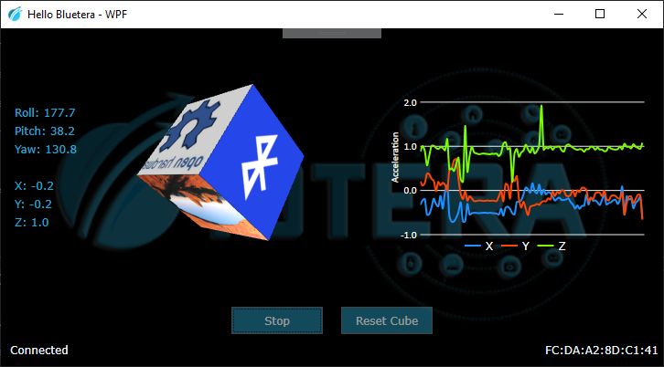

</br>
# Bluetera Firmware
Firmware for the BLE-enabled Bluetera module.</br>

 


Visit our website: https://ioteratech.com
## Getting Started

Bluetera is an open source IoT platform for the development of smart and connected products. The platform includes:
* Bluetera Hardware module - repository [here]()
* Bluetera Firmware (this repository)
* Blutera SDK(s) - repositories [here](https://github.com/ioteratech/)

This guide provides a detailed description on how to build and debug the Bluetera firmware. If you just want to run the sample code without modifying the firmware - checkout the complementary [SDK repositories](https://github.com/ioteratech/).


## Building the project
### Prerequisites
* Windows 7 and later (should work, but not tested on Linux nor Mac).
* Nordic Semiconductor's nRF5 SDK, version 15.2.0 - download [here](https://www.nordicsemi.com/Software-and-Tools/Software/nRF5-SDK/Download#infotabs)
* GNU Tools ARM Embedded<sup id="a1">[1](#f1)</sup>, version '6 2017-q2-update' or higher - download [here](https://developer.arm.com/tools-and-software/open-source-software/developer-tools/gnu-toolchain/gnu-rm/downloads).
* In order to use over-the-air firmware update, you will also need Nordic's "_nrfutil_" tool - see [here](https://www.nordicsemi.com/Software-and-Tools/Development-Tools/nRF-Util).
  
  
you might also want to install:
* Visual Studio Code IDE - download [here](https://code.visualstudio.com)
* Invensense Embedded Motion Driver<sup id="a2">[2](#f1)</sup> (only if you intend to modify the Bluetera IMU driver) - download [here](https://www.invensense.com)

### Installing
You can more-or-less follow the instructions of [this blog](https://devzone.nordicsemi.com/tutorials/b/getting-started/posts/development-with-gcc-and-eclipse), skipping Eclipse-related stuff (that is, unless you want to use Eclipse as your IDE :-)):

* Unzip nRF5-SDK to some folder, preferably with not spaces in the path name. 
* Install the ARM compiler
* Go to the SDK folder, and make sure the build script *<NRF_SDK_ROOT>\components\toolchain\gcc\Makefile.windows* points to the correct version of the ARM compiler. It should look something like:
```
GNU_INSTALL_ROOT := C:/Program Files (x86)/GNU Tools ARM Embedded/6 2017-q2-update/bin/
GNU_VERSION := 6.3.1
GNU_PREFIX := arm-none-eabi
```

#### Test your installation
If all went well, you should be able to build Nordic's sample project:
* Open a command-line under *<NRF_SDK_ROOT>\examples\peripheral\blinky\<BOARD>\s132\armgcc* <br/>(*BOARD* is *pca10040* for nRF52832-DK, and *pca10056* for nRF52840-DK).
* Run *make*
* Check if the firmware image file was created - *_build\nrf52832_xxaa.hex*

### Build
* Set an environment variable *NRF_SDK_ROOT* to the nRF-SDK top folder (e.g. *C:\dev\nordic\sdk\nRF5_SDK_15.2.0_9412b96*).
* Clone this repository, and open a command-line in the top folder
* Run *make*
* The generated firmware image is *_build\bluetera.hex*

## Programming / Debugging the Device
There are two ways to program the Bluetera:
1. By using over-the-air update via a mobile phone - easy, but without debug capabilities. **Unless you require debug capabilities, we recommend using this method.**
2. By using a physical J-Link debugger - requires more effort (soldering, additional hardware etc.), but also enabled debugging the firmware

### Over-the-Air (OTA) Programming
Your Bluetera comes pre-programmed with Nordic's 'secure DFU bootloader'. Over-the-Air programming is a 3-step procedure:
1. Create a Distribution Package - a signed zip archive with updated firmware
2. Copy the package to your mobile phone
3. Program the Bluetera using the 'nRF Connect' mobile application

This guide only covers updating the application firmware. If you wish to also update other components (e.g. the _SoftDevice_), please follow the full guide - [here](https://infocenter.nordicsemi.com/index.jsp?topic=%2Fug_nrfutil%2FUG%2Fnrfutil%2Fnrfutil_intro.html&cp=6_5).

#### Prerequisite
* A Bluetera module
* A Windows 10 machine, with the following software: 
  * Python 2.7 - [here](https://www.python.org/download/releases/2.7/)
  * Nordic's _nrfutil_ application. To install, follow the guide [here](https://infocenter.nordicsemi.com/index.jsp?topic=%2Fug_nrfutil%2FUG%2Fnrfutil%2Fnrfutil_intro.html)
* A mobile phone (Android or iPhone), with Nordic's 'nRF Connect' application installed (get it from [Google Play](https://play.google.com/store/apps/details?id=no.nordicsemi.android.mcp&hl=en) / [App Store](https://apps.apple.com/us/app/nrf-connect/id1054362403))

#### Preparation
* Clone this repository, and open a command-line in the top folder
* Run *make generate_pacakge* - this will build the project, update the bootloader settings page, and create a zip package. 
* Check if the package zip file was created - *bluetera_dfu_pacakge_{current git hash}.zip*

#### Updating the firmware
* Copy the zip package to your mobile device
* Open the 'nRF Connect' application, and connect to the Bluetera
* Click the 'DFU' button (usually top-right), and follow the instructions

### Programming via J-Link debugger
#### Prerequisite
* A Bluetera module (either with or without battery)
* Nordic Semiconductor's Developement Kits ([nRF52832-DK](https://www.nordicsemi.com/Software-and-Tools/Development-Kits/nRF52-DK) / [nRF52840-DK](https://www.nordicsemi.com/Software-and-Tools/Development-Kits/nRF52840-DK)). 
* A Windows 10 machine, with the following software: 
  * Segger J-Link software for Nordic - download [here](https://www.segger.com/downloads/jlink#J-LinkSoftwareAndDocumentationPack) 
  * nRF command line tools - download [here](https://www.nordicsemi.com/?sc_itemid=%7B56868165-9553-444D-AA57-15BDE1BF6B49%7D)
#### Preperation
  * Solder 4 wires to Bluetera SWD pads - VCC, GND, CLK and SIO, shown on the right side of the following image: 
  
   

* Prepare the PCA10040 / PCA10056 board: 
  *  Make sure the main power switch is off
  *  In PCA10056, SW9 (nRF power source) should be on 'VDD', SW6 to 'DEFAULT'
  *  Connect the GND_DETECT pin of header P20 to GND pin of header P1
*  Connect the SWD wires to the board:
   *  Bluetera GND to P1.GND pin
   *  Bluetera VCC to P20.VTG pin
   *  Bluetera CLK to P20.SWD_CLK pin
   *  Bluetera SIO to P20.SWD_IO pin
* If the Bluetera is without battery, you can also power it from the board, by shorting P20.VTG to P20.VDD_nRF pin.

The Following images illustrate the connection without a battery: 
     


### Programming:
  * Connect the Development Board to a PC via USB.
  * Turn it on, and wait until drivers are installed.
  * If all works well, a new virtual drive named 'JLINK' will be added to your machine.
  * Drag-and-Drop the firmware image file: *_build\bluetera.hex* AND *_build/bootloader_settings.hex* to the JLink virtual drive, and wait for the programming to complete.
      
## First Usage (Windows Logger Demo)
Iotera logger demo is a Windows open source app that illustrates the usage of the IMU module and data logging. The source code and app can be found in [this repository]()
1. Prerequisite:
    * Machine with windows operating system 
    * Bluetera device with firmware that fits the Logger APIs
    * BLE CSR Dongle and driver 
    * Logger demo software 
2. Run the demo, turn on your Bluetera, and click 'Start'



## Contributing
* When contributing to this repository, please first discuss the change you wish to make via issue, email, or any other method with the owners of this repository before making a change
* Your code should match the project's code style
* Your code must build without errors nor warnings
* Once ready, create a pull request

## Authors
* **Tomer Abramovich** - [Iotera Technologies](https://ioteratech.com/company/)
* **Boaz Aizenshtark** - [Iotera Technologies](https://ioteratech.com/company/)
* **Avi Rabinovich** - [Iotera Technologies](https://ioteratech.com/company/)

## License
This project is licensed under the MIT License - see the [LICENSE](LICENSE) file for details

## Notes
<sup id="f1">1</sup> Nordic supports other IDEs and toolchains. This repository was only built and tested using GCC. [↩](#a1)

<sup id="f2">2</sup> InvenSense driver is not open-source. You can, however, request the sources from TDK. Bluetera firmware includes the Invensense driver as a pre-compiled library [↩](#a1)
